# Diagram Przypadków Użycia (Use Case Diagram)

## System Rezerwacji Uniwersalnych

```mermaid
graph TB
    subgraph System["System Rezerwacji Uniwersalnych"]
        UC1[Przeglądanie zasobów]
        UC2[Rezerwacja miejsca/zasobu]
        UC3[Zarządzanie rezerwacjami]
        UC4[Tworzenie wydarzeń]
        UC5[Zarządzanie zasobami]
        UC6[Zarządzanie firmą]
        UC7[Zarządzanie członkami firmy]
        UC8[Przeglądanie kalendarza]
        UC9[Zakup biletów]
        UC10[Płatności online]
        UC11[Generowanie raportów]
        UC12[Analityka i statystyki]
        UC13[Zarządzanie miejscami siedzącymi]
        UC14[Zarządzanie użytkownikami]
        UC15[Eksport danych]
    end
    
    Guest[Gość]
    User[Użytkownik]
    Owner[Właściciel]
    Admin[Administrator]
    PaymentSystem[System Płatności]
    EmailSystem[System Email]
    
    Guest -->|korzysta| UC1
    Guest -->|korzysta| UC8
    Guest -->|korzysta| UC2
    
    User -->|korzysta| UC1
    User -->|korzysta| UC2
    User -->|korzysta| UC3
    User -->|korzysta| UC8
    User -->|korzysta| UC9
    User -->|korzysta| UC10
    
    Owner -->|korzysta| UC1
    Owner -->|korzysta| UC2
    Owner -->|korzysta| UC3
    Owner -->|korzysta| UC4
    Owner -->|korzysta| UC5
    Owner -->|korzysta| UC6
    Owner -->|korzysta| UC7
    Owner -->|korzysta| UC8
    Owner -->|korzysta| UC11
    Owner -->|korzysta| UC12
    Owner -->|korzysta| UC13
    Owner -->|korzysta| UC15
    
    Admin -->|korzysta| UC1
    Admin -->|korzysta| UC2
    Admin -->|korzysta| UC3
    Admin -->|korzysta| UC4
    Admin -->|korzysta| UC5
    Admin -->|korzysta| UC6
    Admin -->|korzysta| UC7
    Admin -->|korzysta| UC8
    Admin -->|korzysta| UC11
    Admin -->|korzysta| UC12
    Admin -->|korzysta| UC13
    Admin -->|korzysta| UC14
    Admin -->|korzysta| UC15
    
    UC10 -.->|integruje się z| PaymentSystem
    UC2 -.->|wysyła powiadomienie| EmailSystem
    UC3 -.->|wysyła powiadomienie| EmailSystem
    UC9 -.->|wysyła potwierdzenie| EmailSystem
    
    style Guest fill:#e1f5ff
    style User fill:#b3e5fc
    style Owner fill:#4fc3f7
    style Admin fill:#0288d1
    style PaymentSystem fill:#fff9c4
    style EmailSystem fill:#fff9c4
    style System fill:#f5f5f5
```

## Opis przypadków użycia

### Gość (Guest)
- **UC1: Przeglądanie zasobów** - Przeglądanie dostępnych zasobów (restauracje, kina, sale konferencyjne, teatry)
- **UC2: Rezerwacja miejsca/zasobu** - Tworzenie rezerwacji bez rejestracji (z podaniem emaila/telefonu)
- **UC8: Przeglądanie kalendarza** - Przeglądanie dostępności w kalendarzu

### Użytkownik (User)
Wszystkie funkcje Gościa plus:
- **UC3: Zarządzanie rezerwacjami** - Przeglądanie, edycja i anulowanie swoich rezerwacji
- **UC9: Zakup biletów** - Zakup biletów na wydarzenia
- **UC10: Płatności online** - Realizacja płatności online (Stripe)

### Właściciel (Owner)
Wszystkie funkcje Użytkownika plus:
- **UC4: Tworzenie wydarzeń** - Tworzenie i zarządzanie wydarzeniami
- **UC5: Zarządzanie zasobami** - Tworzenie i edycja zasobów (sale, miejsca)
- **UC6: Zarządzanie firmą** - Zarządzanie danymi firmy
- **UC7: Zarządzanie członkami firmy** - Dodawanie i zarządzanie członkami firmy
- **UC11: Generowanie raportów** - Eksport raportów (CSV, Excel, PDF)
- **UC12: Analityka i statystyki** - Przeglądanie statystyk rezerwacji i przychodów
- **UC13: Zarządzanie miejscami siedzącymi** - Konfiguracja map miejsc siedzących
- **UC15: Eksport danych** - Eksport danych rezerwacji i raportów

### Administrator (Admin)
Wszystkie funkcje Właściciela plus:
- **UC14: Zarządzanie użytkownikami** - Zarządzanie wszystkimi użytkownikami systemu

### Systemy zewnętrzne
- **System Płatności (Stripe)** - Obsługa płatności online
- **System Email** - Wysyłanie powiadomień i potwierdzeń
