# Diagram ERD (Entity Relationship Diagram)

## Model Związków Encji w Systemie Rezerwacji

```mermaid
erDiagram
    ApplicationUser ||--o{ Company : "owns"
    ApplicationUser ||--o{ CompanyMember : "has memberships"
    ApplicationUser ||--o{ Reservation : "makes"
    
    Company ||--o{ Resource : "owns"
    Company ||--o{ CompanyMember : "has members"
    
    CompanyMember }o--|| Company : "belongs to"
    CompanyMember }o--|| ApplicationUser : "is member"
    
    Resource ||--o{ Seat : "has seats"
    Resource ||--o{ Event : "hosts"
    Resource ||--o{ Reservation : "reserved for"
    
    Seat ||--o{ Reservation : "reserved in"
    
    Event ||--o{ Reservation : "linked to"
    Event ||--o| RecurrencePattern : "has pattern"
    
    Reservation ||--|| Resource : "reserves"
    Reservation ||--o| Seat : "reserves seat"
    Reservation ||--o| Event : "for event"
    Reservation ||--o| ApplicationUser : "made by"
    Reservation ||--o{ Ticket : "has tickets"
    Reservation ||--o{ Payment : "has payments"
    
    Ticket }o--|| Reservation : "for"
    
    Payment }o--|| Reservation : "pays for"
    
    ApplicationUser {
        string Id PK
        string Email UK
        string UserName
        string FirstName
        string LastName
        UserRole Role
        datetime CreatedAt
    }
    
    Company {
        int Id PK
        string Name
        string Description
        string Address
        string PhoneNumber
        string Email
        string Website
        string LogoUrl
        string OwnerId FK
        string PrimaryColor
        string SecondaryColor
        bool IsActive
        datetime CreatedAt
        datetime UpdatedAt
    }
    
    CompanyMember {
        int Id PK
        int CompanyId FK
        string UserId FK
        string Role
        bool CanManageResources
        bool CanViewReservations
        bool CanManageReservations
        bool CanManageEvents
        bool CanViewAnalytics
        bool CanExportReports
        bool CanManageMembers
        bool IsActive
        datetime JoinedAt
        datetime LastActivityAt
    }
    
    Resource {
        int Id PK
        string Name
        ResourceType Type
        string Location
        string Description
        int SeatMapWidth
        int SeatMapHeight
        int Capacity
        decimal Price
        string WorkingHours
        int CompanyId FK
        datetime CreatedAt
        datetime UpdatedAt
    }
    
    Seat {
        int Id PK
        int ResourceId FK
        int X
        int Y
        string Label
        string Row
        int Column
        bool IsAvailable
    }
    
    Event {
        int Id PK
        string Title
        string Description
        int ResourceId FK
        datetime StartTime
        datetime EndTime
        int ParentEventId FK
    }
    
    RecurrencePattern {
        int Id PK
        int EventId FK
        string RecurrenceType
        int Interval
        string DaysOfWeek
        int DayOfMonth
        int MonthOfYear
        datetime StartDate
        datetime EndDate
        int MaxOccurrences
    }
    
    Reservation {
        int Id PK
        string UserId FK
        string GuestEmail
        string GuestPhone
        int ResourceId FK
        int SeatId FK
        int EventId FK
        datetime StartTime
        datetime EndTime
        ReservationStatus Status
        bool IsPaid
        datetime CreatedAt
        datetime UpdatedAt
    }
    
    Ticket {
        int Id PK
        int ReservationId FK
        decimal Price
        TicketStatus Status
        string PurchaseReference
        datetime CreatedAt
        datetime PurchasedAt
    }
    
    Payment {
        int Id PK
        int ReservationId FK
        string StripePaymentIntentId
        string StripeChargeId
        decimal Amount
        string Currency
        PaymentStatus Status
        datetime CreatedAt
        datetime PaidAt
        string FailureReason
        string Metadata
    }
```

## Legenda typów relacji

- `||--o{` : One to Many (jeden do wielu)
- `}o--||` : Many to One (wiele do jednego)
- `||--||` : One to One (jeden do jednego)
- `||--o|` : One to Zero or One (jeden do zera lub jednego)

## Opis głównych encji

### ApplicationUser
Użytkownik systemu z rozszerzeniem ASP.NET Identity. Może być Gościem, Użytkownikiem, Właścicielem lub Administratorem.

### Company
Firma będąca właścicielem zasobów. Każda firma ma właściciela (Owner) i może mieć wielu członków (Members).

### CompanyMember
Łącznik między użytkownikiem a firmą - reprezentuje członkostwo w firmie z odpowiednimi uprawnieniami.

### Resource
Uniwersalny zasób do rezerwacji (restauracja, kino, sala konferencyjna, teatr). Należy do firmy.

### Seat
Miejsce siedzące w zasobie z współrzędnymi (X, Y) do wizualizacji mapy miejsc.

### Event
Wydarzenie odbywające się w zasobie. Może mieć wzorzec powtarzania (RecurrencePattern).

### Reservation
Rezerwacja zasobu lub miejsca przez użytkownika lub gościa. Może być powiązana z wydarzeniem.

### Ticket
Bilet wystawiony dla rezerwacji. Umożliwia sprzedaż biletów na wydarzenia.

### Payment
Płatność za rezerwację realizowana przez Stripe. Przechowuje status i szczegóły transakcji.

### RecurrencePattern
Wzorzec powtarzania dla cyklicznych wydarzeń (codziennie, co tydzień, co miesiąc, etc.).
