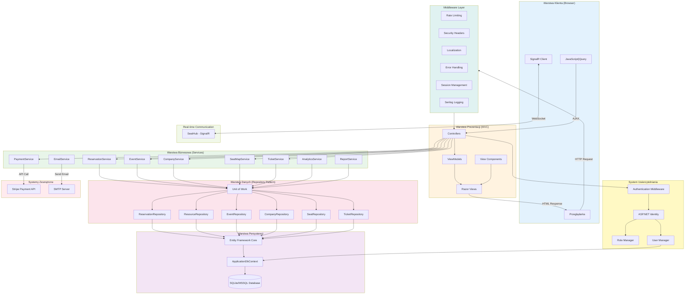

# Diagram Architektury MVC

## Architektura Systemu Rezerwacji Uniwersalnych

## Opis warstw architektury

### 1. Warstwa Klienta (Client Layer)
- **Przeglądarka**: Interfejs użytkownika (HTML, CSS, Bootstrap)
- **JavaScript/jQuery**: Interaktywność po stronie klienta
- **SignalR Client**: Komunikacja w czasie rzeczywistym (aktualizacje dostępności miejsc)

### 2. Warstwa Prezentacji (Presentation Layer) - MVC
- **Controllers**: Obsługa żądań HTTP, walidacja danych wejściowych, koordynacja przepływu
  - `ReservationController`: Zarządzanie rezerwacjami
  - `EventController`: Zarządzanie wydarzeniami
  - `CompanyController`: Zarządzanie firmami
  - `ResourceController`: Zarządzanie zasobami
  - `AccountController`: Uwierzytelnianie i autoryzacja
  
- **Views**: Szablony Razor do renderowania HTML
  - Widoki dla rezerwacji, wydarzeń, zasobów
  - Layout i partial views
  - Formularz rezerwacji z mapą miejsc
  
- **ViewModels**: Transfer danych między kontrolerami a widokami
  - `ReservationCreateViewModel`
  - `EventViewModel`
  - `CompanyViewModel`
  
- **ViewComponents**: Komponenty wielokrotnego użytku
  - Kalendarz rezerwacji
  - Mapa miejsc siedzących

### 3. Warstwa Biznesowa (Business Layer) - Services
Implementacja logiki biznesowej:
- **ReservationService**: Tworzenie, walidacja i zarządzanie rezerwacjami
- **EventService**: Zarządzanie wydarzeniami i wzorcami powtarzania
- **PaymentService**: Integracja z Stripe, obsługa płatności
- **CompanyService**: Zarządzanie firmami i zasobami
- **SeatMapService**: Zarządzanie mapami miejsc siedzących
- **TicketService**: Generowanie i zarządzanie biletami
- **EmailService**: Wysyłanie powiadomień email
- **AnalyticsService**: Analiza danych i statystyki
- **ReportService**: Generowanie raportów (CSV, Excel, PDF)

### 4. Warstwa Danych (Data Layer) - Repository Pattern
- **Unit of Work**: Zarządzanie transakcjami i koordynacja repozytoriów
- **Repositories**: Abstrakcja dostępu do danych
  - Separacja logiki biznesowej od dostępu do danych
  - Możliwość łatwej zmiany źródła danych
  - Testowanie za pomocą mock objects

### 5. Warstwa Persystencji (Persistence Layer)
- **Entity Framework Core**: ORM do mapowania obiektów na bazę danych
- **ApplicationDbContext**: Kontekst bazy danych z konfiguracją encji
- **Database**: SQLite (domyślnie) lub MSSQL Server

### 6. System Uwierzytelniania (Identity)
- **ASP.NET Core Identity**: Zarządzanie użytkownikami i rolami
- **Authentication Middleware**: Weryfikacja tożsamości
- **Role Manager**: Zarządzanie rolami (Admin, Owner, User, Guest)
- **User Manager**: Operacje na użytkownikach

### 7. Middleware Layer
- **Rate Limiting**: Ograniczanie liczby żądań (ochrona przed nadużyciami)
- **Security Headers**: Nagłówki bezpieczeństwa (CSP, X-Frame-Options)
- **Localization**: Obsługa wielu języków (PL, EN)
- **Error Handling**: Obsługa błędów i wyjątków
- **Session Management**: Zarządzanie sesjami użytkowników
- **Serilog Logging**: Logowanie zdarzeń i błędów

### 8. Real-time Communication (Hubs)
- **SeatHub**: SignalR hub dla aktualizacji w czasie rzeczywistym
  - Blokowanie miejsc podczas rezerwacji
  - Powiadomienia o zmianach dostępności

### 9. Systemy Zewnętrzne (External Systems)
- **Stripe Payment API**: Płatności online
- **SMTP Server**: Wysyłanie emaili

## Przepływ danych (Request Flow)

1. **Browser** → HTTP Request → **Middleware** (security, auth, rate limiting)
2. **Middleware** → **Controller** (routing, validation)
3. **Controller** → **Service** (business logic)
4. **Service** → **Unit of Work** → **Repository** (data access)
5. **Repository** → **EF Core** → **Database** (query execution)
6. **Database** → **EF Core** → **Repository** (results)
7. **Repository** → **Service** (processed data)
8. **Service** → **Controller** (business result)
9. **Controller** → **View** (model binding)
10. **View** → **Browser** (HTML response)

## Wzorce projektowe wykorzystane w systemie

- **MVC (Model-View-Controller)**: Separacja prezentacji, logiki i danych
- **Repository Pattern**: Abstrakcja dostępu do danych
- **Unit of Work**: Zarządzanie transakcjami
- **Dependency Injection**: Luźne powiązanie komponentów
- **Service Layer**: Enkapsulacja logiki biznesowej
- **ViewModel Pattern**: Transfer danych między warstwami
- **Middleware Pipeline**: Przetwarzanie żądań HTTP
