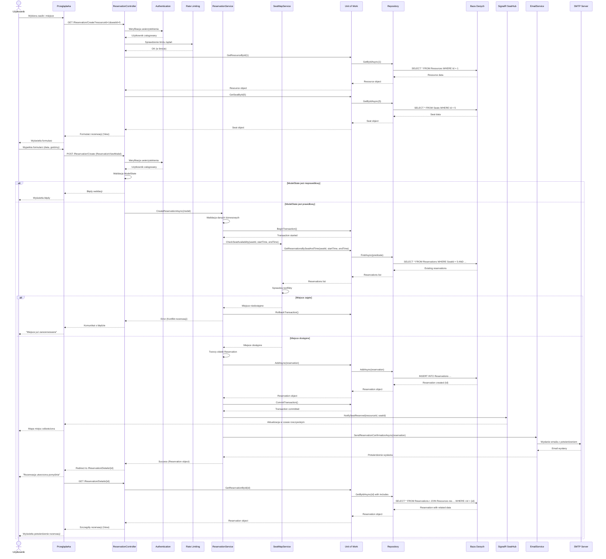

# Diagram Sekwencji - Rezerwacja Sali

## Proces rezerwacji miejsca/zasobu w systemie

## Opis przepływu procesu rezerwacji

### Faza 1: Wyświetlenie formularza rezerwacji

1. **Użytkownik** wybiera zasób i opcjonalnie miejsce siedzące
2. **Przeglądarka** wysyła żądanie GET do `/Reservation/Create`
3. **Middleware** weryfikuje uwierzytelnienie i rate limiting
4. **Controller** pobiera dane zasobu i miejsca z bazy danych przez Unit of Work
5. **Widok** z formularzem jest zwracany użytkownikowi

### Faza 2: Walidacja i sprawdzenie dostępności

6. **Użytkownik** wypełnia formularz (data rozpoczęcia, zakończenia, opcjonalne dane)
7. **Przeglądarka** wysyła żądanie POST z danymi rezerwacji
8. **Controller** waliduje dane wejściowe (ModelState)
9. **ReservationService** wykonuje walidację biznesową
10. **SeatMapService** sprawdza dostępność miejsca w podanym czasie
    - Sprawdzenie konfliktów z istniejącymi rezerwacjami
    - Sprawdzenie godzin otwarcia zasobu

### Faza 3: Tworzenie rezerwacji (success path)

11. **Unit of Work** rozpoczyna transakcję bazodanową
12. **ReservationService** tworzy obiekt rezerwacji
13. **Repository** zapisuje rezerwację do bazy danych
14. **Unit of Work** commituje transakcję
15. **SignalR Hub** wysyła powiadomienie do wszystkich połączonych klientów o zmianie dostępności
16. **EmailService** wysyła email z potwierdzeniem rezerwacji
17. **Controller** przekierowuje użytkownika do szczegółów rezerwacji
18. **Przeglądarka** wyświetla potwierdzenie

### Faza 3a: Obsługa konfliktu (error path)

- Jeśli miejsce jest zajęte w wybranym czasie:
  - Transakcja jest wycofywana (rollback)
  - Użytkownik otrzymuje komunikat o błędzie
  - Formularz jest ponownie wyświetlany z błędem

### Faza 4: Wyświetlenie szczegółów

19. **Użytkownik** jest przekierowany do strony szczegółów rezerwacji
20. **Controller** pobiera pełne dane rezerwacji z powiązanymi encjami
21. **Widok** wyświetla potwierdzenie z wszystkimi szczegółami

## Alternatywne ścieżki

### Scenariusz 1: Rezerwacja jako gość (bez logowania)

Dla gości (niezalogowanych użytkowników):
- Pomijane jest uwierzytelnienie
- Wymagane jest podanie emaila lub telefonu (GuestEmail/GuestPhone)
- Rezerwacja jest tworzona bez powiązania z użytkownikiem (UserId = null)
- Email z potwierdzeniem jest wysyłany na GuestEmail

### Scenariusz 2: Rezerwacja na wydarzenie

Jeśli rezerwacja jest tworzona dla konkretnego wydarzenia:
- EventId jest przekazywane w żądaniu
- Godziny są automatycznie ustawiane na podstawie wydarzenia
- Rezerwacja jest powiązana z wydarzeniem

### Scenariusz 3: Przekroczenie limitu żądań (Rate Limiting)

Jeśli użytkownik przekroczy limit żądań:
- Middleware Rate Limiting zwraca błąd 429 (Too Many Requests)
- Użytkownik musi poczekać przed kolejną próbą

### Scenariusz 4: Błąd walidacji

Jeśli dane formularza są nieprawidłowe:
- ModelState zawiera błędy
- Formularz jest ponownie wyświetlany z komunikatami o błędach
- Żadne dane nie są zapisywane w bazie

## Wzorce wykorzystane w procesie

- **Transaction Management**: Unit of Work zarządza transakcją
- **Repository Pattern**: Abstrakcja dostępu do danych
- **Service Layer**: Logika biznesowa w ReservationService
- **Real-time Communication**: SignalR dla aktualizacji w czasie rzeczywistym
- **Asynchronous Processing**: Wysyłanie emaili asynchronicznie
- **Middleware Pipeline**: Authentication, Rate Limiting
- **Error Handling**: Rollback transakcji przy błędzie
